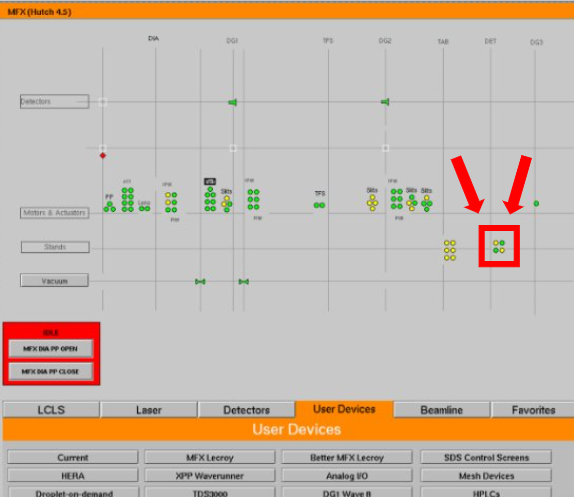
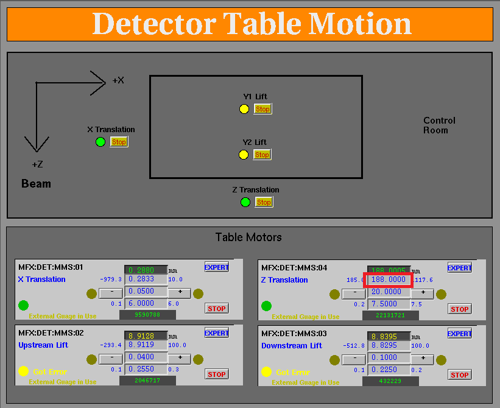
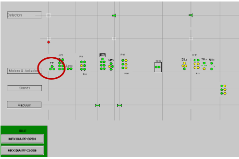
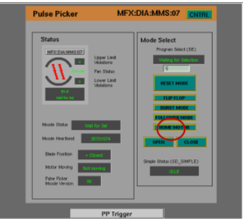

# Operators Guide

Last Revised: June 2024  
Author: Pamela Schleissner
**IN CASE OF EMERGENCY PRESS F12**  
--> Enables attenuator 11: att(1e-16)

## Novice User

1.  Starting and using the DAQ (data acquisition system):

    a.  **restartdaq** -- Launches daq, **restartdaq -w** launches DAQ
        with the windows in their previous position

    b.  **startami** -- restarts ami, use if daq is working but ami is
        frozen

    - Load the window configuration

    c.  It is good practice to let the DAQ run freely to get updated
        detector and AMI plots in between scans without recording
        (**daq.disconnect()** and then "begin run" from dropdown menu in
        DAQ window, with unchecked "Record Run"). Pulse picker needs to
        be in **'open'** or **'flip flop'** mode for observations

2.  MFX Home page:

    a.  **mfxhome** -- Launches MFX home

    b.  Checking for faults you may have to clear if the beam goes down:
        LCLS → LFE Home → General tab → PMPS Diagnostics → clear faults

3.  MFX Python:

    a.  From a seperate terminal **mfx3** starts a python session

    b.  If python freezes: **exit()** then **mfx3** to restart

4.  Open **camViewer** and **eloggrabber** from a terminal

5.  X-ray attenuation: **att(1e-16)** max. **att(1)** min attenuation →
    100% transmission

6.  Moving the Rayonix detector:

a.  **Use small step sizes!** If you move the detector in one step, you
    will crash the detector into the spectrometer, because it overshoots
    in the end!

b.  Pull out the flight tube out (slowly) before moving the detector in

c.  Remember to put the flight tube in against the kapton before data
    collection

7.  Pedestals:

    a.  For epix100 and epix10k2M:

        i.  From a terminal: **takepeds** (will take control of daq,
            need to disconnect DAQ if not done before), confirm X-rays
            are blocked (**stopper S4.5 is inserted**) and it will start
            taking pedestals

        ii. Once takepeds is done, run **makepeds** following the prompt
            (eg. **makepeds -u \<userid\> -q milano -r 28** )

    b.  For the Rayonix detector:

        i.  From a terminal:\
            \>\> **ssh -X hsuser@con-ics-mfx-rayonix**\
            \>\> **killall procServ**\
            \>\> **capxure**\
            \
            A new window will appear. Change the "single trigger" option
            to "none". Change "exposure" to "dark". Click "collect new
            background". Change "exposure" to "normal". Click "collect
            new background". Change "single trigger" back to frame. Exit
            this window, file → quit\
            \
            In the previous terminal: \>\>
            **./startDaqInterface_newcradyl**

    c.  *After collecting and deploying a pedestal, allocate to the
        DAQ.* In the DAQ window: Shutdown → Allocate → Begin Running

8.  Running Scans:

    a.  autorun(sample = '<SAMPLE TAG>', run_length = 300,
        record=True, runs = 5, inspire=False, daq_delay=5,
        picker='flip')

        i.  <Sample tag>: user defined

        ii. run_length=300: in seconds

        iii. record=True: records data in DAQ

        iv. runs = 5: number of runs

        v.  inspire=False: set to True if you need some inspiration to
            keep hope alive

        vi. daq_delay=5: delay time between runs. Increase is the DAQ is
            being slow

        vii. picker='flip': If 'open' pulse picker opens before the run
             starts. If 'flip' it flip-flops before run starts

## Troubleshooting 😵‍ 

Don't see X-rays?

1.  Did you remove the stopper 4.5?

2.  Is the pulse picker in "flip-flop"?

3.  Are you attenuated?

4.  Check "are we ready?" In a terminal type **awr mfx**

Are the plots frozen (AMI)?

1.  Try shutting down the daq: In DAQ window **Shutdown** → **Allocate**
    →**Begin Running**

2.  Try restarting AMI: in a terminal that is not running python
    **startami**

3.  Try restarting the DAQ: in a terminal window that is not running
    python **restartdaq -w**

4.  Call beamline technical support

Is the DAQ frozen?

1.  Try restarting the DAQ: in a terminal window that is not running
    python **restartdaq -w**

2.  Call beamline technical support

Did the pulse picker lose its position?

1.  On MFX home, open the pulse picker tab

2.  Click "home motor". It will go in "home motor mode"

3.  Click "home motor" (again). The motor will begin moving

4.  Wait until it's done moving

5.  Then hit "Reset Mode"

## Experienced Users

1.  Plotting AMI

2.  Running CCTBX

    a.  Edit cctbx.xfel file by changing the experiments name (e.g.
        xcsl######)

    b.  In a terminal that is running python: **source
        \<path\>/cctbx.xfel**

    c.  A new window will appear with the cctbx.XFEL login. Click OK.

    d.  Change the trial number in the options page. Click on "Auto plot
        last five runs"

    e.  Click "Hide Options" to see plots. Optional "Large text" for big
        screens.

3.  Running OM

